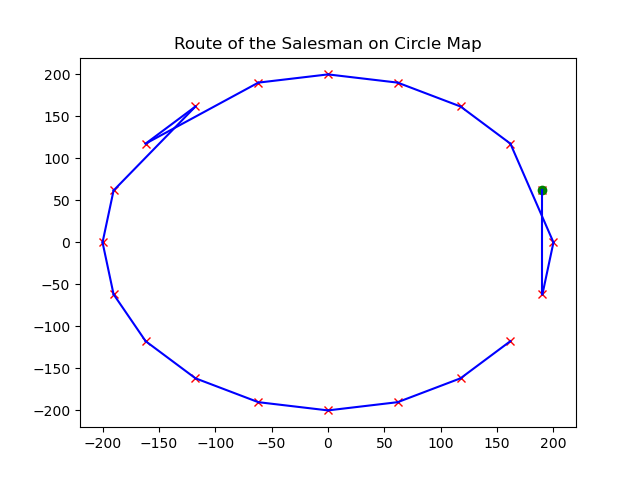
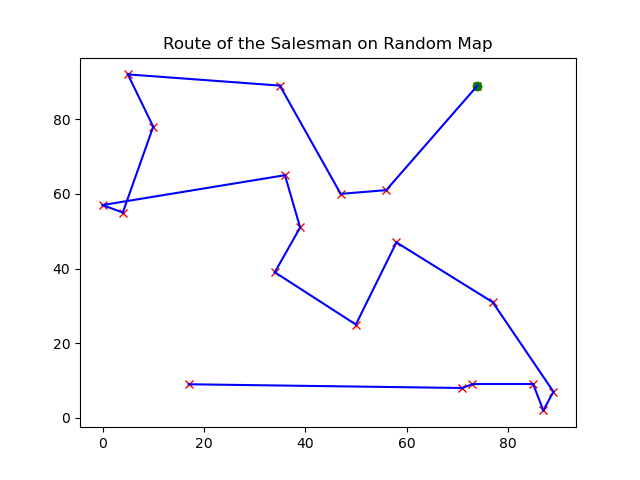
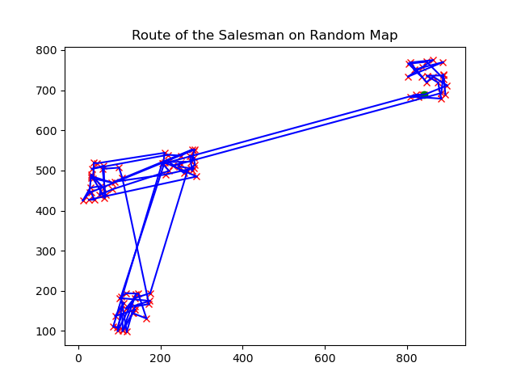

# Searching Algorithms (SearchAlgs)

## About
This repository contains an Implementation of Simulated Annealing. Simulated annealing (SA) is a probabilistic technique for approximating the global optimum of a given function. Specifically, it is a metaheuristic to approximate global optimization in a large search space for an optimization problem. It is often used when the search space is discrete (e.g., the traveling salesman problem) (More information at [Wikipedia Simulated Annealing](https://en.wikipedia.org/wiki/Simulated_annealing)

Additionally this repository includes some "Maps" on which to test the Algorithm and visualize it. Note that visualizing the process is computationally expensive, so the default mode doesn't animate the process. This maps are shown below in the animated process.
<p float="center">
  
  
  
</p>
<div>
  <p>Figure: From left to right, Maps circle, random, random_cluster. Solutions </p>
</div>

<p float="center">
  
  
</p>
<div>
  <p>Figure: From left to right, Maps circle and random. Animation</p>
</div>

I intend in slowly add more algorithms and options, like pathfinders and other optimization algorithms like [Ant_colony_optimization_algorithm](https://en.wikipedia.org/wiki/Ant_colony_optimization_algorithms).

## Installation
* Cloning the repository ```git clone https://github.com/raulorteg/SearchAlgs```
* Installing requirements ```pip install -r requirements.txt```
* Setting up ``` python setup.py bdist_wheel```
* Install modules ``` pip install -e .```

## Usage
After installation simply import the modules in the usual way ```Import SimulatedAnnealing, maps```.
Examples of scripts using these functions can be found in the examples folder. E.g.

```
from maps import Circle_Map
from SimulatedAnnealing import Simulated_Annealing

def main():

    # Lets test it in the Circle map
    circle_map = Circle_Map(num_cities=20)
    cost_matrix = circle_map.get_distances()

    simulation = Simulated_Annealing(cost_matrix=cost_matrix, temp_type='log', init_method='random', max_iter=500)
    path, path_cost, cost_list = simulation.run(map=circle_map, animate=False)

    # print results in command line
    print(f"Path solution: {path}")
    print(f"Cost of solution path: {path_cost}")

    # plot the resulting solution
    circle_map.plot(path)

if __name__ == "__main__":
    main()
```
